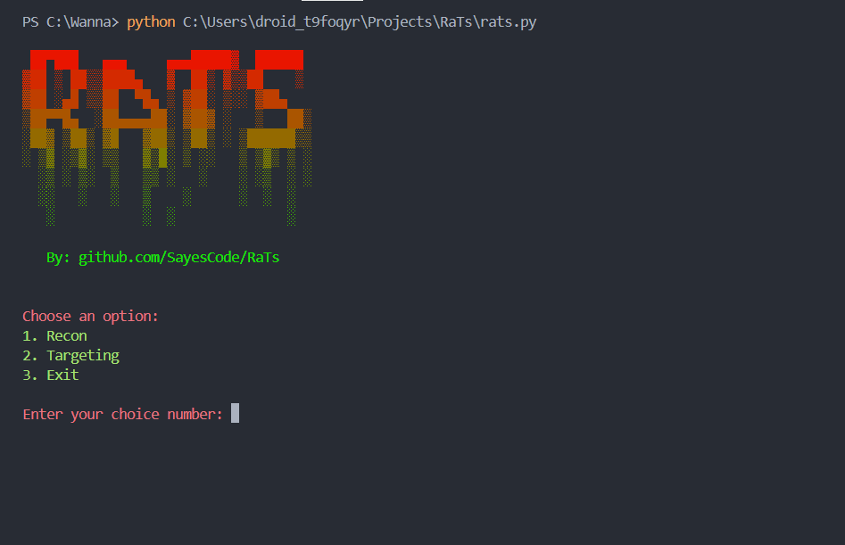

# RaTs By SayesCode

 

**RaTs** é um sistema automatizado para tarefas de reconhecimento e direcionamento, com integração fácil de chaves API e funcionalidades interativas. Ele ajuda a validar números de telefone e e-mails por meio de APIs externas e oferece uma interface de linha de comando para execução fluida.

---

## Recursos Principais

- **Reconhecimento (Recon):** Executa tarefas detalhadas de reconhecimento.
- **Direcionamento (Targeting):** Foco em alvos definidos.
- **Validação Automática de Chaves:** Verifica e auxilia na configuração de chaves API.

---

## Como Usar

1. Certifique-se de ter o Python instalado (>= 3.8).
2. Clone o repositório:
   ```bash
   git clone https://github.com/SayesCode/RaTs.git && cd RaTs
   ```
3. Instale as dependências:
   ```bash
   pip install -r requirements.txt
   ```
4. Configure as chaves API no arquivo `.env`:
   ```env
   NUMVERIFY_API_KEY=your_api_key_here
   HUNTER_API_KEY=your_api_key_here
   ```
5. Execute o sistema:
   ```bash
   python main.py
   ```

---

## Contribuição

Sinta-se à vontade para abrir problemas ou enviar pull requests para melhorias.

---

## Licença

Distribuído sob a licença MIT. Veja `LICENSE` para mais informações.

---
